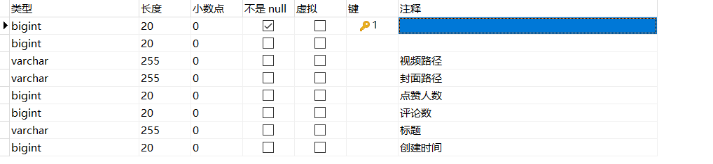

分表：
- user

- login

- video

- comment

- favorite

- relation


用户登录：`login` 表中，`email` 添加唯一索引

发布列表：`video` 表中，`user_id` 添加普通索引

点赞操作：`favorite` 表中，`user_id` 添加普通索引

评论列表：`comment` 表中，`video_id` 添加普通索引

关注和粉丝列表：`relation` 表，`user_id` 和 `to_user_id` 加普通索引

user
```sql
CREATE TABLE `relation` (
    `id` bigint(20) NOT NULL AUTO_INCREMENT,
    `user_id` bigint(20) DEFAULT NULL COMMENT '粉丝',
    `to_user_id` bigint(20) DEFAULT NULL COMMENT '作者',
    `is_follow` tinyint(255) DEFAULT NULL COMMENT '是否关注（或取消）',
    PRIMARY KEY (`id`) USING BTREE,
    KEY `id_user_id` (`user_id`) USING BTREE,
    KEY `id_to_user_id` (`to_user_id`) USING BTREE
) ENGINE=InnoDB AUTO_INCREMENT=22 DEFAULT CHARSET=utf8mb4 ROW_FORMAT=DYNAMIC;
```

login
```sql
CREATE TABLE `login` (
  `id` bigint(20) NOT NULL AUTO_INCREMENT,
  `email` varchar(255) DEFAULT NULL,
  `password` varchar(255) DEFAULT NULL,
  PRIMARY KEY (`id`) USING BTREE,
  UNIQUE KEY `id_email` (`email`) USING BTREE
) ENGINE=InnoDB AUTO_INCREMENT=20 DEFAULT CHARSET=utf8mb4 ROW_FORMAT=DYNAMIC;
```

video
```sql
CREATE TABLE `video` (
  `id` bigint(20) NOT NULL AUTO_INCREMENT,
  `author_id` bigint(20) DEFAULT NULL,
  `play_url` varchar(255) DEFAULT NULL COMMENT '视频路径',
  `cover_url` varchar(255) DEFAULT NULL COMMENT '封面路径',
  `favorite_count` bigint(20) DEFAULT NULL COMMENT '点赞人数',
  `comment_count` bigint(20) DEFAULT NULL COMMENT '评论数',
  `title` varchar(255) DEFAULT NULL COMMENT '标题',
  `created_at` bigint(20) DEFAULT NULL COMMENT '创建时间',
  PRIMARY KEY (`id`) USING BTREE,
  KEY `id_author_id` (`author_id`) USING BTREE
) ENGINE=InnoDB AUTO_INCREMENT=6 DEFAULT CHARSET=utf8mb4 ROW_FORMAT=DYNAMIC;
```

comment
```sql
CREATE TABLE `comment` (
  `id` bigint(20) NOT NULL AUTO_INCREMENT,
  `video_id` bigint(20) DEFAULT NULL,
  `user_id` bigint(20) DEFAULT NULL,
  `content` varchar(255) DEFAULT NULL COMMENT '用户评论内容',
  `create_date` varchar(255) DEFAULT NULL COMMENT '评论时间',
  `deleted_at` bigint(255) DEFAULT NULL COMMENT '评论删除时间',
  PRIMARY KEY (`id`) USING BTREE,
  KEY `id_video_id` (`video_id`) USING BTREE
) ENGINE=InnoDB AUTO_INCREMENT=23 DEFAULT CHARSET=utf8mb4 ROW_FORMAT=DYNAMIC;
```

favorite
```sql
CREATE TABLE `favorite` (
  `id` bigint(20) NOT NULL AUTO_INCREMENT,
  `user_id` bigint(20) DEFAULT NULL COMMENT '用户id',
  `video_id` bigint(20) DEFAULT NULL COMMENT '用户已点赞的视频id',
  `is_favorite` tinyint(255) DEFAULT NULL,
  PRIMARY KEY (`id`) USING BTREE,
  KEY `id_user_id` (`user_id`) USING BTREE
) ENGINE=InnoDB AUTO_INCREMENT=28 DEFAULT CHARSET=utf8mb4 ROW_FORMAT=DYNAMIC;
```

relation
```sql
CREATE TABLE `relation` (
  `id` bigint(20) NOT NULL AUTO_INCREMENT,
  `user_id` bigint(20) DEFAULT NULL COMMENT '粉丝',
  `to_user_id` bigint(20) DEFAULT NULL COMMENT '作者',
  `is_follow` tinyint(255) DEFAULT NULL COMMENT '是否关注（或取消）',
  PRIMARY KEY (`id`) USING BTREE,
  KEY `id_user_id` (`user_id`) USING BTREE,
  KEY `id_to_user_id` (`to_user_id`) USING BTREE
) /*!50100 STORAGE MEMORY */ ENGINE=InnoDB AUTO_INCREMENT=22 DEFAULT CHARSET=utf8mb4 ROW_FORMAT=DYNAMIC;
```
